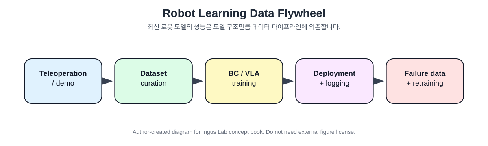

# 7장. 데이터와 툴체인: VLA 성능을 만드는 실제 파이프라인

VLA나 robot foundation model을 이야기할 때 모델 구조만 보면 절반만 보는 것입니다. 실제 성능은 데이터 수집, teleoperation, labeling, dataset curation, training, deployment, logging, retraining으로 이어지는 **data flywheel**에서 나옵니다.



## 7.1 ALOHA와 ACT

ALOHA는 low-cost bimanual manipulation system과 imitation learning pipeline을 제안했습니다. 특히 ACT, Action Chunking Transformer는 한 번에 action 하나를 예측하는 대신 action chunk를 예측해 imitation learning의 compounding error를 줄이려는 접근입니다. [Zhao et al. (2023), ALOHA / ACT](https://arxiv.org/abs/2304.13705)

```text
Observation:
    multi-view images + joint positions

Policy:
    Transformer / CVAE-style action chunk prediction

Output:
    future action sequence
```

ACT의 메시지는 VLA와도 연결됩니다. 로봇 제어에서 한 step action만 예측하면 작은 오차가 누적되기 쉽습니다. action chunk를 예측하면 policy가 짧은 horizon의 temporal structure를 더 잘 다룰 수 있습니다.

## 7.2 Mobile ALOHA

Mobile ALOHA는 ALOHA를 mobile base와 whole-body teleoperation으로 확장했습니다. 논문은 low-cost whole-body teleoperation system으로 bimanual mobile manipulation data를 수집하고, 기존 static ALOHA dataset과 co-training하면 mobile manipulation performance가 좋아진다고 보고했습니다. [Fu et al. (2024), Mobile ALOHA](https://arxiv.org/abs/2401.02117)

이 연구의 교훈은 두 가지입니다.

```text
1. 로봇 학습은 하드웨어/teleoperation 설계와 분리되지 않는다.
2. 기존 데이터와 새 task 데이터를 함께 학습하는 co-training이 중요하다.
```

## 7.3 DROID: in-the-wild robot manipulation dataset

DROID는 in-the-wild robot manipulation dataset으로, 76k demonstration trajectories, 350 hours, 수백 개 scene, 80개 이상의 tasks를 포함합니다. [Khazatsky et al. (2024), DROID](https://arxiv.org/abs/2403.12945)

DROID의 의의는 “실험실 안의 동일한 tabletop”이 아니라, 여러 장소와 장면에서 수집한 다양한 데이터를 강조한다는 점입니다. generalist policy가 실제 환경에서 잘 동작하려면, 데이터도 실제 환경의 다양성을 담아야 합니다.

## 7.4 LeRobot: end-to-end robot learning library

LeRobot은 low-level middleware communication, dataset collection, storage/streaming, state-of-the-art algorithms, inference stack까지 포함하는 open-source end-to-end robot learning library입니다. [Cadene et al. (2026), LeRobot](https://arxiv.org/abs/2602.22818)

이런 도구가 중요한 이유는 VLA 연구가 점점 “논문 모델 하나”에서 “재현 가능한 개발 생태계”로 이동하고 있기 때문입니다.

```text
Hardware control
    ↓
Dataset collection
    ↓
Dataset streaming
    ↓
Policy training
    ↓
Inference
    ↓
Deployment
    ↓
Logging
```

## 7.5 데이터 수집 시 기록해야 하는 것

실제 로봇 학습 데이터를 모을 때는 image와 action만으로 충분하지 않습니다.

```text
필수 기록:
- timestamp
- camera images / depth
- robot joint states
- end-effector pose
- gripper state
- force/torque if available
- action command
- executed action
- task instruction
- workflow state
- success/failure label
- failure reason
- human correction
- device state / interlock
```

특히 실험 자동화 시스템에서는 장비 상태도 중요합니다.

```text
예:
- capping station power state
- thermoshaker connection state
- HPLC ready/busy/error state
- vial detected / not detected
- smartcap detected / not detected
- tray position verified / not verified
```

## 7.6 이 장의 핵심 정리

```text
VLA 성능은 모델 구조보다 데이터 파이프라인에 크게 의존한다.

좋은 데이터는 다음을 포함해야 한다:
    image + robot state + instruction + action + outcome + failure reason

실무 전략:
    처음부터 완전한 VLA를 목표로 하지 말고,
    logging 가능한 skill-based robot system을 먼저 만들고,
    그 데이터를 나중에 VLA/BC/IL 학습에 사용한다.
```
