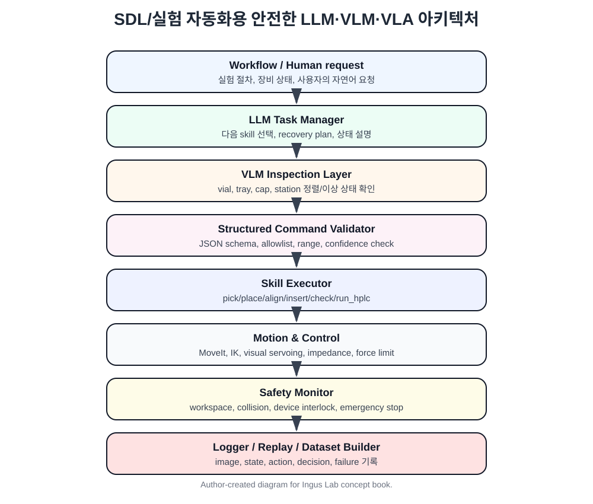

# 8장. 안전한 시스템 설계: 문자열을 로봇 명령으로 바꾸는 법

LLM/VLM/VLA를 실제 로봇에 붙일 때 가장 위험한 설계는 다음입니다.

```text
model output string → 바로 robot command 실행
```

로봇은 물리 세계를 움직입니다. 따라서 문자열 hallucination은 단순한 오답이 아니라 충돌, 파손, 오염, 안전사고로 이어질 수 있습니다. ASIMOV Benchmark는 VLM/LLM이 로봇 brain으로 사용될 때 semantic safety를 평가해야 한다는 문제의식을 제기했고, foundation model이 물리적 접촉을 수행하는 로봇을 제어할 때 safety가 즉각적인 관심사가 된다고 설명합니다. [Sermanet et al. (2025), ASIMOV Benchmark](https://arxiv.org/abs/2503.08663)

## 8.1 안전한 전체 구조



기본 원칙은 다음입니다.

```text
LLM/VLM/VLA:
    제안한다.

Validator:
    검사한다.

Planner/Controller:
    실행 가능한 motion으로 바꾼다.

Safety Monitor:
    실행 중 감시하고 중단한다.
```

## 8.2 structured output

모델에게 자유 문장을 받지 말고, schema가 있는 JSON을 받는 것이 좋습니다.

```json
{
  "type": "skill_call",
  "skill": "align_to_hole",
  "arguments": {
    "target": "capping_station_hole",
    "mode": "visual_servoing",
    "max_translation_mm": 3.0,
    "max_rotation_deg": 2.0
  },
  "confidence": 0.84,
  "failure_policy": "stop_and_ask_human"
}
```

이 JSON에서 실제 실행에 쓰는 것은 `skill`, `arguments`, `confidence`, `failure_policy`입니다. 설명 문장이나 reasoning text는 로봇 명령으로 사용하지 않습니다.

## 8.3 validation checklist

실행 전에는 최소한 다음을 확인해야 합니다.

```text
Schema validation:
    JSON field가 맞는가?
    type이 맞는가?

Allowlist:
    skill이 허용된 목록에 있는가?

Range check:
    이동량, 속도, 힘 제한을 넘지 않는가?

State check:
    현재 workflow state에서 이 skill이 가능한가?

Perception confidence:
    VLM/detector confidence가 충분한가?

Frame check:
    base_link, tool0, camera frame 변환이 유효한가?

IK feasibility:
    목표 pose에 대한 IK 해가 있는가?

Collision check:
    self-collision / environment collision이 없는가?

Device interlock:
    장비가 ready 상태인가?

Runtime monitor:
    force, velocity, timeout, emergency stop 조건이 있는가?
```

## 8.4 action space는 처음에 좁게 시작한다

VLA를 실험하더라도 처음부터 모든 action을 허용하면 안 됩니다. 처음에는 다음 정도만 허용하는 것이 좋습니다.

```text
허용:
- stop
- ask_human
- move_relative small delta
- open_gripper
- close_gripper
- inspect_state

제한적으로 허용:
- move_to_pose with collision check
- visual_servo_align
- force_limited_insert

금지:
- arbitrary joint command
- arbitrary torque command
- high-force contact
- deep insertion without verification
- unknown device operation
```

## 8.5 task space와 joint space

LLM/VLM/VLA 출력은 가능한 한 task space 또는 skill space로 제한하는 것이 좋습니다.

```text
추천:
    skill_call
    task-space pose
    end-effector delta
    keypoint target
    visual servoing target

비추천:
    raw joint angles
    raw torque
    unrestricted velocity command
```

joint space는 로봇 controller 내부에서는 필요하지만, 모델이 직접 출력하기에는 위험합니다. joint limit, singularity, self-collision, branch 선택 문제가 있기 때문입니다.

## 8.6 ROS 2 구현 예시

ROS 2 기준으로는 다음 노드 구조를 추천합니다.

```text
/vlm_inspector_node
    input: camera image, workflow state
    output: InspectionResult.msg

/llm_task_manager_node
    input: user instruction, workflow state, inspection result
    output: SkillCommand.msg

/command_validator_node
    input: SkillCommand
    output: ValidatedCommand or RejectedCommand

/skill_executor_action_server
    actions:
        PickVial
        PlaceVial
        AlignToHole
        InsertWithForceLimit
        CheckSmartcap
        Stop

/motion_layer
    MoveIt, IK, Servo, visual servoing, impedance control

/safety_monitor_node
    force, collision, workspace, device interlock, timeout

/logger_node
    image, state, command, action, success/failure 기록
```

## 8.7 이 장의 핵심 정리

```text
LLM/VLM/VLA output은 command가 아니라 proposal이다.

proposal은 반드시 다음 과정을 거쳐야 한다:
    parse → validate → plan → check → execute → monitor → log

실제 로봇 시스템에서 가장 중요한 것은 모델 성능보다 안전한 인터페이스다.
```
